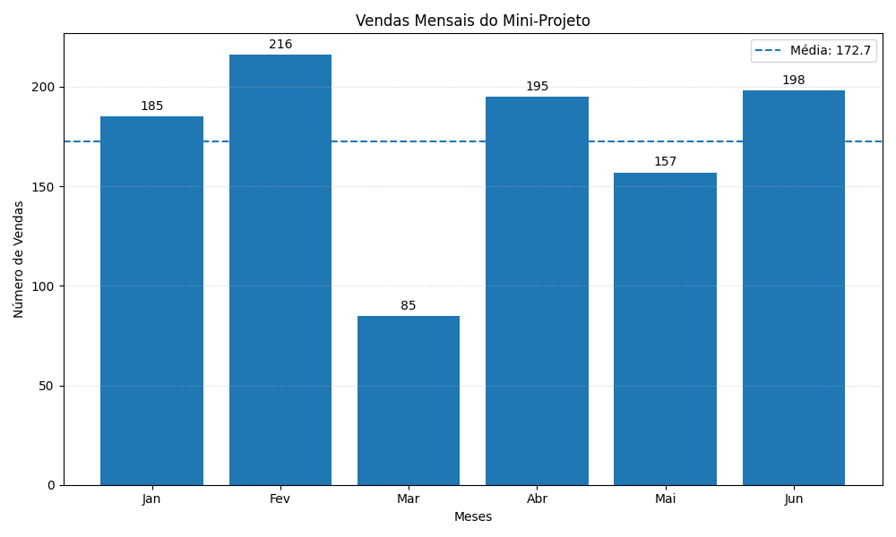

# 📊 Vendas Mensais com Python e Matplotlib

Este projeto é um mini-projeto desenvolvido em Python com o objetivo de demonstrar conceitos fundamentais de programação, organização de código e visualização de dados.

A aplicação simula vendas mensais, calcula métricas importantes e apresenta os resultados através de um gráfico de barras utilizando a biblioteca Matplotlib.

---

## 🚀 Funcionalidades

- Geração de dados aleatórios (simulação de vendas)
- Cálculo da média de vendas
- Identificação do melhor e pior mês
- Apresentação de relatório no terminal
- Visualização gráfica dos dados

---

## 🖼️ Exemplo de saída



---

## 🛠️ Tecnologias utilizadas

- Python 3
- Matplotlib
- Random (biblioteca standard)

---

## 📂 Estrutura do projeto

```
📁 projeto
 ┣ 📄 vendas_mensais_graficos.py
 ┗ 📄 README.md
```

---

## ▶️ Como executar

1. Instalar dependências:

```bash
pip install matplotlib
```

2. Executar o programa:

```bash
python vendas_mensais_graficos.py
```

---

## 🧠 Conceitos aplicados

Este projeto demonstra vários conceitos importantes:

### ✔️ Organização do código
O programa está estruturado com uma função principal (`main`) e funções internas com responsabilidades específicas:
- `gerar_vendas()`
- `calcular_media()`
- `mostrar_resumo()`
- `criar_grafico()`

### ✔️ Funções internas
As funções são definidas dentro da `main()`, o que ajuda a manter o código organizado e encapsulado.

### ✔️ Geração de dados
Utilização da biblioteca `random` para simular dados reais.

### ✔️ Visualização de dados
Uso do Matplotlib para criar gráficos claros e informativos.

---

## 📊 Como funciona o gráfico

O gráfico apresenta:

- Barras → número de vendas por mês
- Linha tracejada → média de vendas
- Valores no topo de cada barra
- Grelha para melhor leitura

O código utiliza:

```python
plt.bar()
plt.axhline()
plt.bar_label()
```

---


## 🎯 Objetivo do projeto

Este projeto foi desenvolvido no contexto de aprendizagem de Python, com foco em:

- boas práticas de programação
- organização de código
- visualização de dados

Serve como base para projetos mais avançados na área de análise de dados.

---

## 👩‍💻 Autora

Cristiane Oliveira  
📍 Portugal  
💡 Foco em Data Analysis e Desenvolvimento

---

## ⭐ Nota

Este é um projeto educativo, ideal para quem está a iniciar em Python e quer compreender como transformar dados em informação visual.
